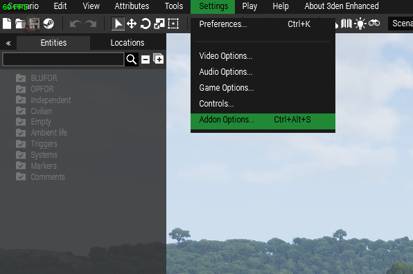

# This goes over all the pieces of this folder, what they are and how to use them.
------

Their are three items in this folder.

### Addon option Text File **Not included yet**
------

These are your addon options. Please import these as they are shown directly into Eden.

Then click the import button. Select all the contents of the text file provided in this github, and paste it into the shown box to correctly import all the addon settings.

### Provided Compositions
------

Compositions are custom "groups" per say. This allows you to spawn in a large amount of players or modules into your map with just a single click. You are able to move around these modules even change their settings if you desire. If you delete one, best practice is delete and respawn the whole composition again.

If you need to edit these compositions please contact Support-Request with your request before making a merge request.

To give Eden access to these custom compositions open up the file explorer. Locate the compositions folder under the correct profile within Arma 3 - Other Profiles. Copy any composition from this github directly into the folder. The folder structure is fairly rigid holding, a composition.sqe file and a header.sqe file. If you're confused by this process follow [this video](https://www.youtube.com/watch?v=HjKURvNhfJ4) and look at the files within your compositions folder.

#### 10SOCSpawn
This is the required spawn that needs to be somewhere on the map. It does not matter where said players are located, they just need to be on a land mass somewhere on the map. If you do not mess with this composition it will provide all the required number and order of the slots.

### GameMasterHC
This composition includes all the administration tools. Providing the correct Zues slots, headless clients, etc. Place this composition off the playing area to keep your map clean. Do not touch anything within this composition.
